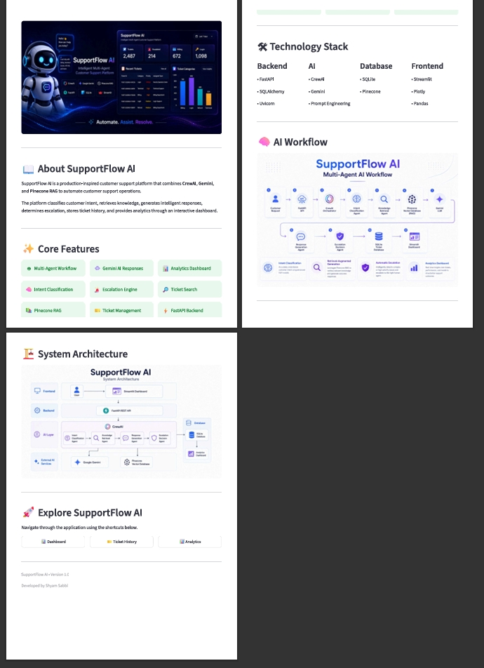
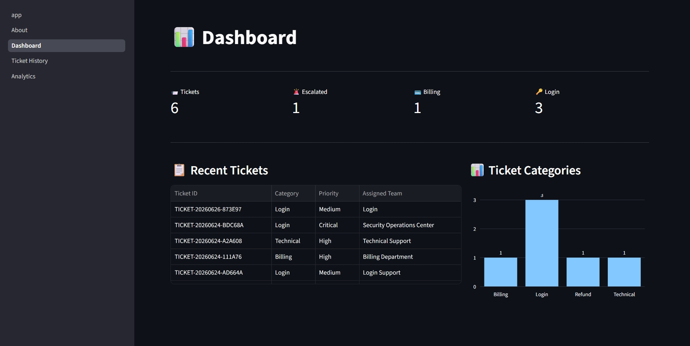
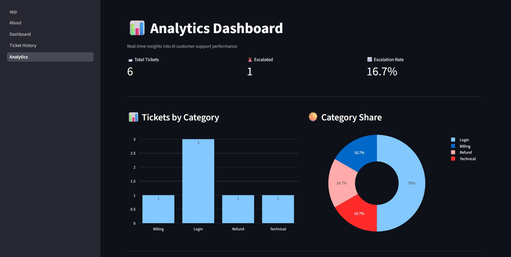
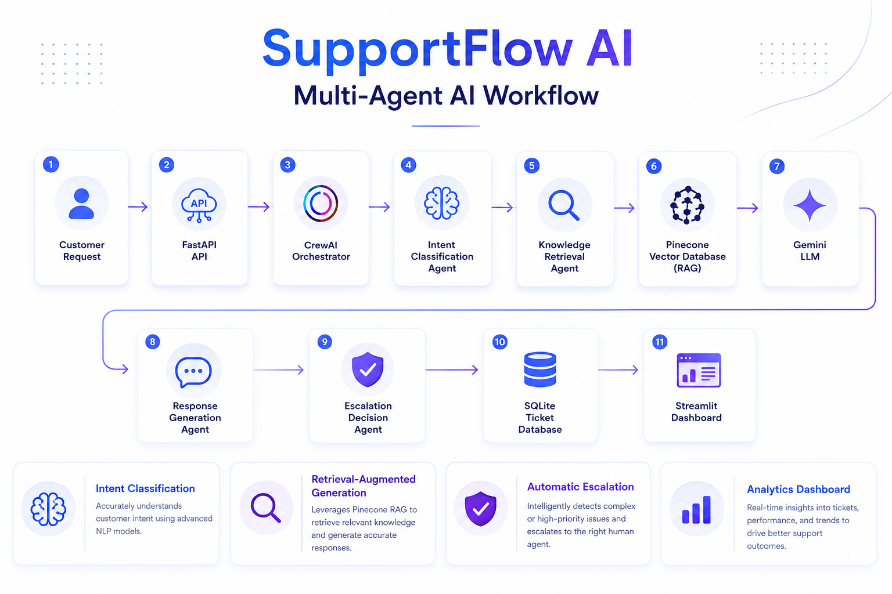
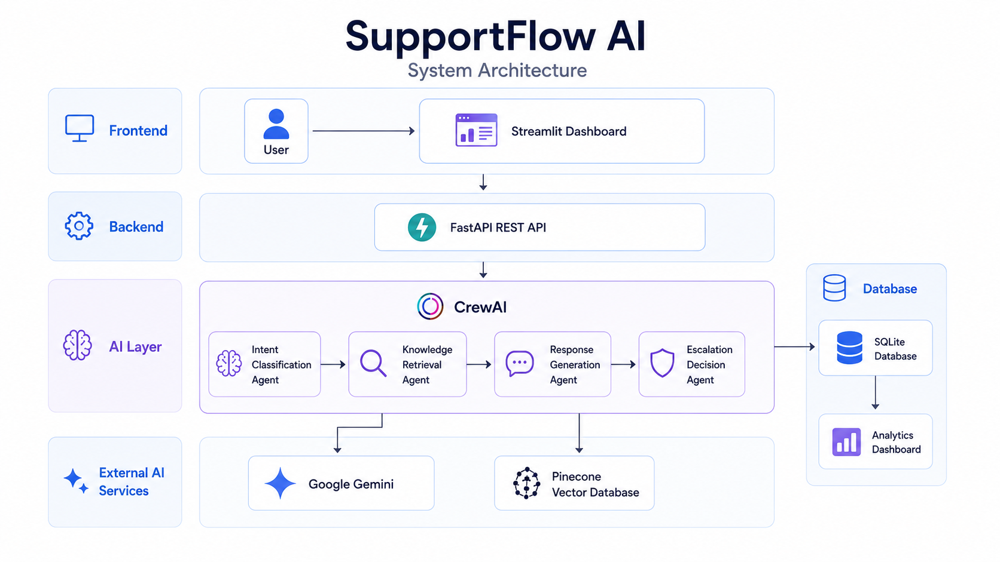

# 🤖 SupportFlow AI

### Intelligent Multi-Agent Customer Support Platform

AI-powered customer support platform built with <strong>CrewAI</strong>,
<strong>Google Gemini</strong>, <strong>Pinecone RAG</strong>,
<strong>FastAPI</strong>, and <strong>Streamlit</strong>.

---

# 🚀 Overview

SupportFlow AI is a production-inspired **multi-agent customer support platform**
that automates customer service using **CrewAI**, **Google Gemini**, and
**Retrieval-Augmented Generation (RAG)**.

The platform intelligently:

- 🧠 Classifies customer intent
- 📚 Retrieves knowledge using Pinecone RAG
- 💬 Generates contextual AI responses
- 🚨 Determines escalation requirements
- 💾 Stores ticket history in SQLite
- 📊 Visualizes analytics through Streamlit

SupportFlow AI demonstrates how multiple AI agents can collaborate to automate
real-world customer support workflows while maintaining a scalable backend
architecture.

---

# ✨ Key Features

- 🤖 Multi-Agent AI Workflow using CrewAI
- 🧠 Intent Classification
- 📚 Retrieval-Augmented Generation (RAG)
- 🔍 Pinecone Vector Search
- 💬 Google Gemini Response Generation
- 🚨 Intelligent Escalation Engine
- 💾 SQLite Ticket Database
- 📊 Interactive Analytics Dashboard
- 🎫 Searchable Ticket History
- ⚡ FastAPI REST API
- 🖥 Modern Streamlit Interface
- 🐳 Docker Ready

## 📸 Application Preview

### 🤖 About

The About page introduces SupportFlow AI, highlights its AI capabilities, technology stack, and provides quick navigation to the main application modules.

---

### 📊 Dashboard

The Dashboard provides a real-time overview of customer support operations, including ticket statistics, escalation metrics, category distribution, and recent customer requests.

---

### 🎫 Ticket History

The Ticket History page allows users to browse, search, and review previously processed customer support tickets, including ticket category, priority, sentiment, assigned team, and escalation status.

---

### 📈 Analytics

The Analytics dashboard visualizes ticket trends and operational metrics, helping support teams monitor customer issues and identify recurring patterns.

---

# 🔄 AI Workflow

SupportFlow AI processes every customer request through a sequential multi-agent workflow powered by **CrewAI**.

### Workflow Steps

1. Customer submits a support request.
2. FastAPI receives the request.
3. CrewAI orchestrates the workflow.
4. Intent Classification Agent identifies the customer's issue.
5. Knowledge Retrieval Agent searches the Pinecone vector database using Retrieval-Augmented Generation (RAG).
6. Google Gemini generates a contextual customer response.
7. Escalation Agent determines whether human intervention is required.
8. The processed ticket is stored in SQLite.
9. Streamlit visualizes ticket history and analytics.

---

# 🏗️ System Architecture

SupportFlow AI follows a modular architecture consisting of:

* **Frontend:** Streamlit Dashboard
* **Backend:** FastAPI REST API
* **AI Orchestration:** CrewAI Multi-Agent System
* **Large Language Model:** Google Gemini
* **Knowledge Retrieval:** Pinecone Vector Database
* **Database:** SQLite
* **Visualization:** Plotly

The modular design allows each component to operate independently while enabling seamless communication between AI agents, APIs, databases, and the user interface.
