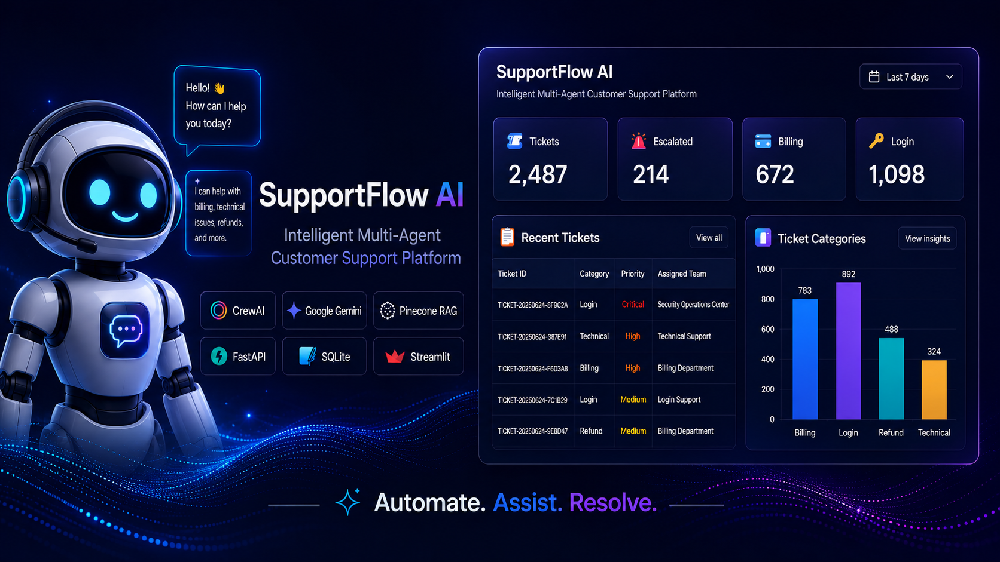

# 🤖 SupportFlow AI

### Intelligent Multi-Agent Customer Support Platform

AI-powered customer support platform built with <strong>CrewAI</strong>,
<strong>Google Gemini</strong>, <strong>Pinecone RAG</strong>,
<strong>FastAPI</strong>, and <strong>Streamlit</strong>.

---

# 🚀 Overview

SupportFlow AI is a production-inspired **multi-agent customer support platform**
that automates customer service using **CrewAI**, **Google Gemini**, and
**Retrieval-Augmented Generation (RAG)**.

The platform intelligently:

- 🧠 Classifies customer intent
- 📚 Retrieves knowledge using Pinecone RAG
- 💬 Generates contextual AI responses
- 🚨 Determines escalation requirements
- 💾 Stores ticket history in SQLite
- 📊 Visualizes analytics through Streamlit

SupportFlow AI demonstrates how multiple AI agents can collaborate to automate
real-world customer support workflows while maintaining a scalable backend
architecture.

---

# ✨ Key Features

- 🤖 Multi-Agent AI Workflow using CrewAI
- 🧠 Intent Classification
- 📚 Retrieval-Augmented Generation (RAG)
- 🔍 Pinecone Vector Search
- 💬 Google Gemini Response Generation
- 🚨 Intelligent Escalation Engine
- 💾 SQLite Ticket Database
- 📊 Interactive Analytics Dashboard
- 🎫 Searchable Ticket History
- ⚡ FastAPI REST API
- 🖥 Modern Streamlit Interface
- 🐳 Docker Ready
